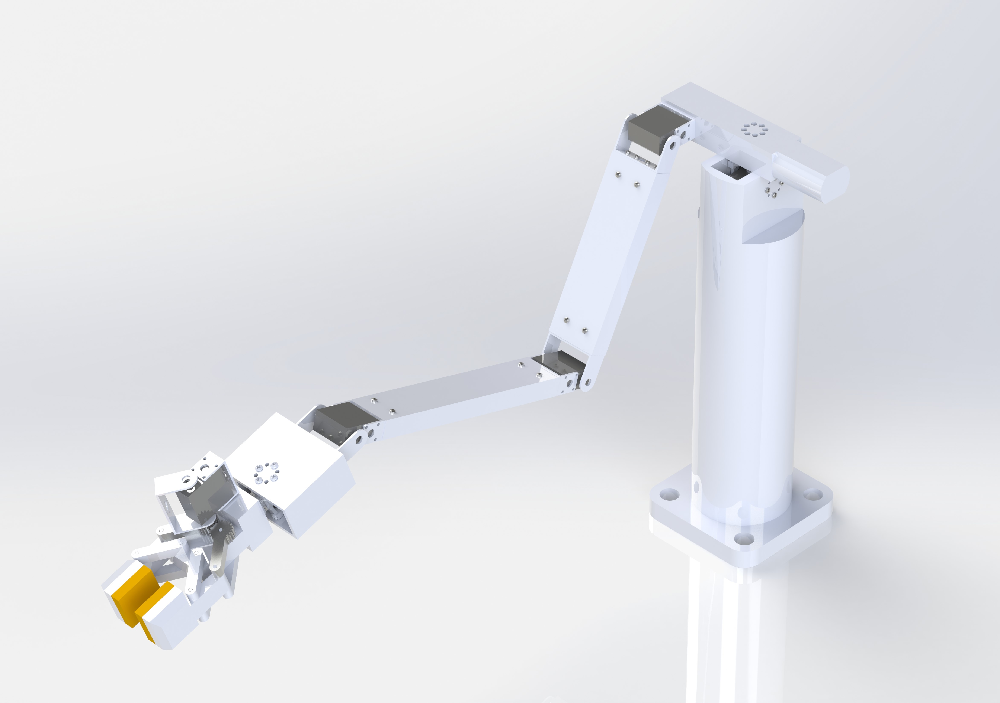

# Robotic arm controlled using an electronic glove

This repository contains a project with the mechanical design of a robotic arm meant to copy the movements of a user.
The arm has been mechanically designed using SolidWorks, and has been programed using Arduino.

## Folders
* Inside the [Arduino](Arduino) folder, we can find the code and the libraries used to control the robotic arm using the glove.
* Inside the [MATLAB](MATLAB) folder, we can find the code used to simulate the robot motion. The folder includes the [Robotics Toolbox](https://petercorke.com/toolboxes/robotics-toolbox/) package from [Peter Corke](https://github.com/petercorke).
* Inside the [SolidWorks](SolidWorks) folder, we can find all the 3D parts and the assembly regarding the mechanical design of the robot.

## Author
* Josep Rueda Collell: rueda_999@hotmail.com

